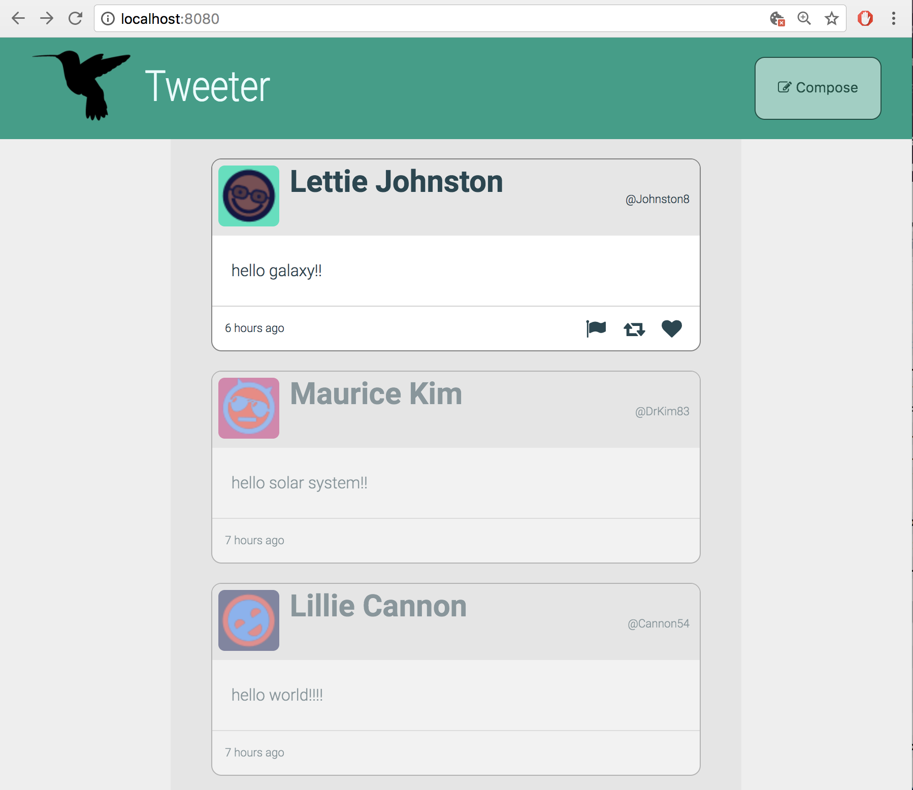
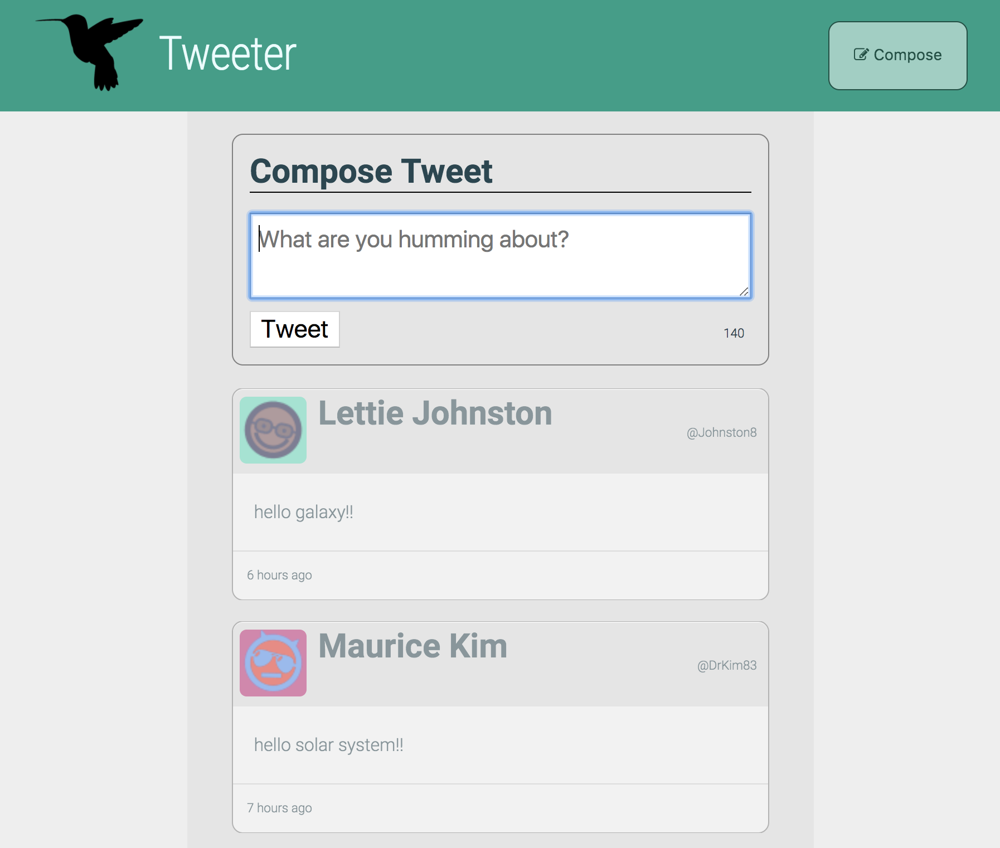

# Tweeter Project

Tweeter is a simple, single-page Twitter clone.

Built to develop upon front-end skills using HTML, CSS, JS, jQuery and AJAX, and back-end skills using Node, Express and MongoDB.

## Final Product

A simple single-page application that allows users to post tweets onto the page. Posted tweets, unlike my TinyApp are saved in a persistent on-disk database via MongoDB. Focusing more on the front-end aspect of web development, Tweeter has several interactive features such as sliding tweet form, character counter, and warnings when users do not input tweets within the required parameters. Tweets and buttons are resposive to mouse hovers and change change appearance upon interaction. Also displayed is a tweetpost-time counter in the footer of every tweet.

## Getting Started

1. Fork this repository, then clone your fork of this repository.
2. Install dependencies using the `npm install` command.
3. Start the web server using the `npm run local` command. The app will be served at <http://localhost:8080/>.
4. Go to <http://localhost:8080/> in your browser.

## Dependencies

- Express
- Node 5.10.x or above
- Body-parser
- Chance
- MongoDB
- Node Sass Middleware

## Notes

Some extra features are added to my app as listed below:

1. The compose component of tweeter shakes and displays a warning in-line when a user inputs too many characters rather than an alert.

2. The placeholder within the textarea changes to inform the user when they they submit an empty tweet rather than an alert.

3. Title icon added and shown in the tab bar.